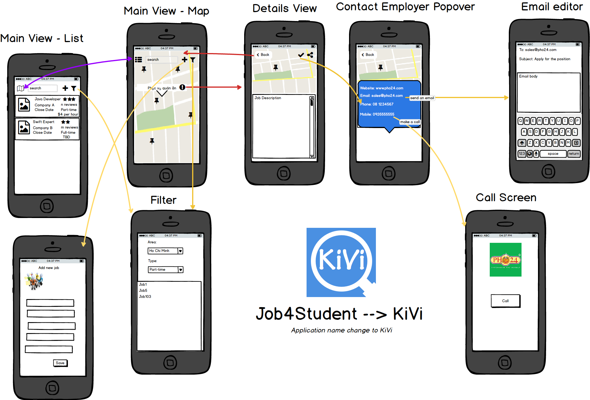
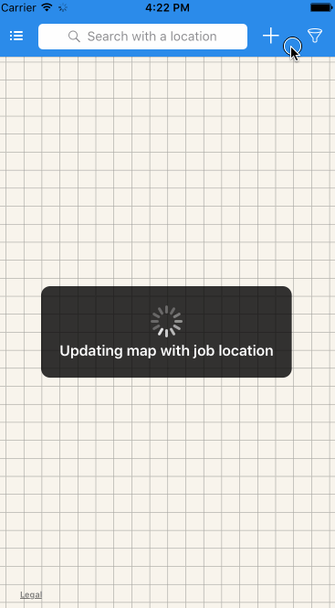

# KiVi
Application to help student find a job much more easily

# Descriptions:
KiVi, short form of Kiem Viec (Find a job in English) is an application that help students from Colleges, Universities can find a job that suitable for them.
The app focus on jobs for students only, including part-time or full time jobs.

## REQUIRED:

- [x] Search results page
   - [x] Search by location and updated on Map and List 
   - [x] Search bar is in the navigation bar .
   - [x] User can switch between Map and List View
- [x] Job
   - [x] Can view all jobs within 20km from their current location 
   - [x] Can view jobs summary by selecting a pin on map.
   - [x] Can view job details.
- [x] Job details and  job application 
   - [x] Apply by phone call. send and email by calling: UIApplication.sharedApplication().openURL
   - [x] When apply directly, will show a map with routes to the job location by calling: mapItem.openInMapsWithLaunchOptions(launchOptions)
   - [x] Job can be shared to socials by using: UIActivityViewController
- [x] Add a new job
   - [x] Take photo at job location, app will get current location and tag to it, save to server.
   - [x] Photo can be read and used in map and list view

## OPTIONALS:
### For Students: 
- Can share jobs info to their friends through Email, SMS.
- Also can set job expectations on their profiles.
- Can set profiles for private or public.
- Must have student ID to be qualified as a student, universities will help to verify this ID.
- Can set interested job fields, e.g: engineering, marketing, ... and set notifications.
- Application must have push notification when new jobs are posted by companies.
- 
### For Companies:
- Payment method for companies: bank card, bank account or cash
- Currency for payments.

### For Companies:
- Must input Business License number to be qualified.
- Can post jobs.
- Can post expectations, requirements for students.
- Can search database to select students.
- Will pay for application and services to get premium access into database.

### For Schools, Colleges, Universities:
- Review expectations from Student.
- Review companies' expectations and requirements to update their program to fit them.

## App Wireframe: 

## Notes:
- Project is developed based on XCode 7
